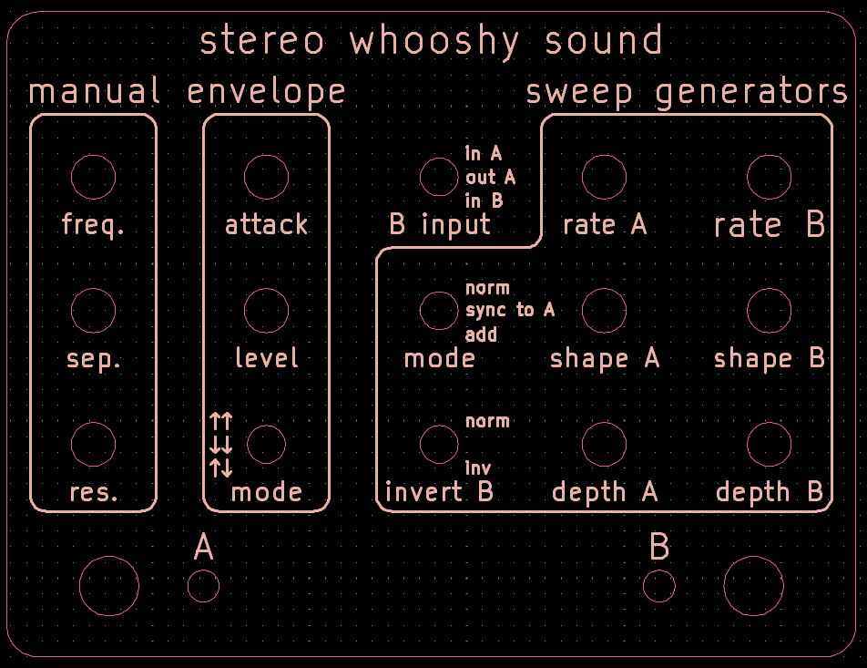
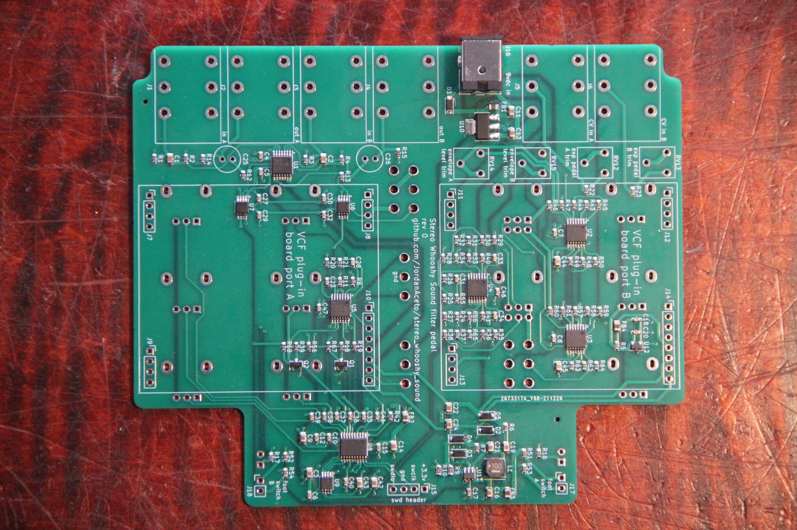

# Stereo Whooshy Sound

## It's a stereo version of [this](https://github.com/JordanAceto/whooshy_sound)

- ### The interface is modeled after the Mu-Tron Bi-Phase with some additions.

## [SCHEMATIC](https://github.com/JordanAceto/stereo_whooshy_sound/blob/master/hardware/main_pcb/construction_docs/stereo_whooshy_sound_schematic.pdf)

## Work in progress, next steps:
- build a pcb and evaluate the analog circuits
- update the firmware for stereo operation
- finish the front panel design (I'm pretty sure there are errors)
### Front panel idea (not final)

## PCB for evaluation:

## Status of the project:

Task | Status |
---------|--------------|
Schematic capture | &#9745;
PCB layout | &#9745;
Test build | &#9744;
Safe to order boards| &#9744;
